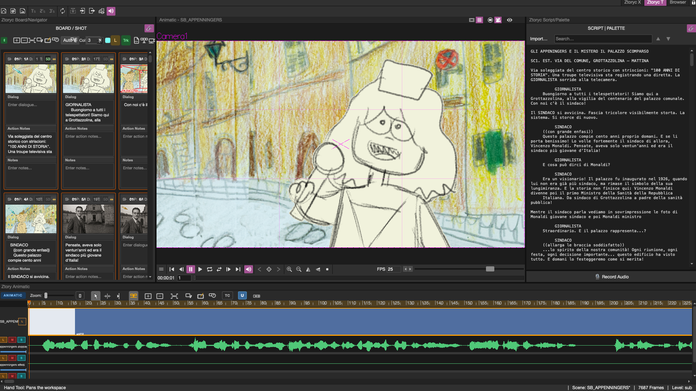
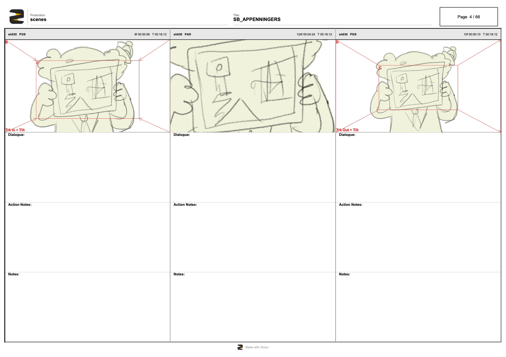
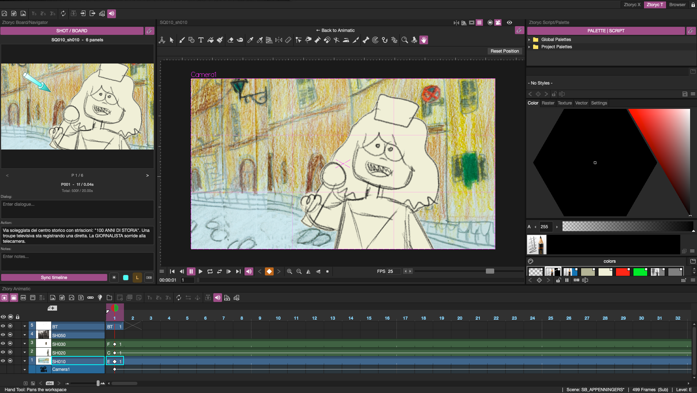
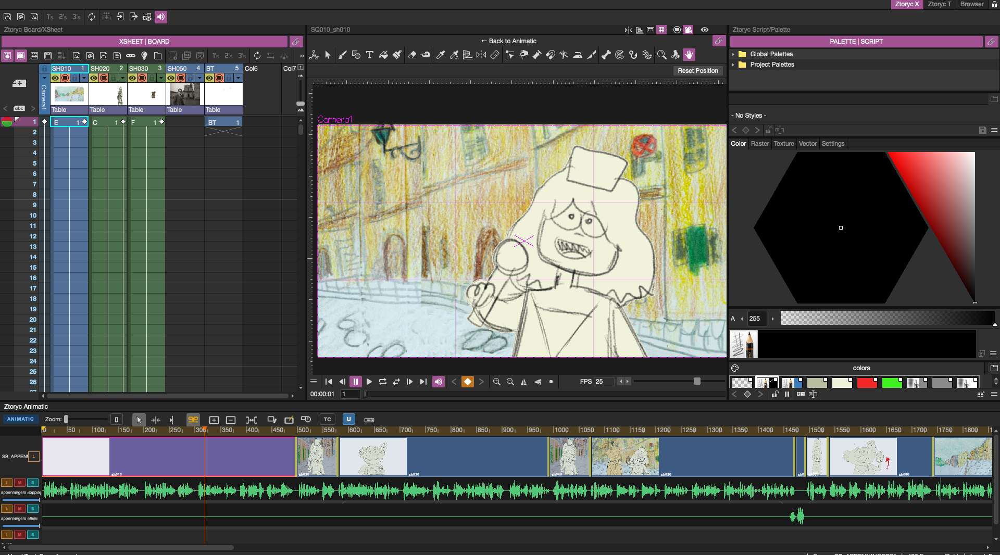

# Ztoryc

**The complete solution for professional storyboarding.** From your first thumbnail to the final animatic, Ztoryc supports your creative work through every stage of pre-production — free, open source, and built by artists for artists.

Ztoryc is a fork of Tahoma2D built for storyboard artists, directors and studios who need a serious, professional tool to tell better stories, before a single frame is animated.

Ztoryc works for any production — animated or live action. If you use Tahoma2D or OpenToonz for 2D animation, it integrates directly into your pipeline, but it works as a standalone storyboarding tool for any workflow.



---

## Download

Grab the latest release for **macOS** and **Windows** from the [Releases page](https://github.com/matitanimata/ztoryc/releases).

**macOS — first launch:** the app is not notarized yet. After copying `Ztoryc.app` to `/Applications`, run in Terminal:

```bash
xattr -cr /Applications/Ztoryc.app
```

then open normally (right-click → Open the first time).

**Windows:** a clean install is recommended — uninstall any previous version first.

---

## Why Ztoryc

The storyboard is where a production is won or lost. Ztoryc is built for the artists and directors who know that — and need a professional tool that respects their craft.

Professional storyboard software is either expensive, locked into proprietary ecosystems, or limited in functionality. Ztoryc aims to change that.

In most pipelines the storyboard is created in a separate application and later rebuilt in the animation software. This creates duplicated work, manual animatic timing, and loss of shot structure between departments.

Ztoryc, working together with Tahoma2D / OpenToonz, takes a different approach: the storyboard becomes the foundation of the scene itself — from first sketch to final layout.

---

## Output

- 📄 **PDF storyboard** — export your boards as a professional storyboard document, complete with per-panel durations, dialogue, camera moves and light-direction annotations
- 🎬 **Animatic** — export the animatic in standard video formats with audio, optional burn-in (timecode, shot/panel names) and clapperboard
- 🎞️ **Layouts** — for productions using Tahoma2D / OpenToonz, Ztoryc exports each shot as a ready-to-animate `.tnz` scene complete with storyboard panels, audio, and camera moves
- 🔊 **Per-shot audio clips** — export the audio of each shot as separate files for the animation department



---

## Features

### Storyboard (BOARD room)
- Panel-based storyboard grid — multiple panels per shot, auto-detected from keyframes, camera moves and drawing changes
- Configurable grid, drag & drop shot reordering, multi-selection
- Copy / clone / paste shots — shared clipboard with the Animatic
- Shot numbering modes: Auto / Keep / Renumber All, with sequence support
- **Camera-move annotations** — START/STOP framing overlay with arrows and A→B lettering, drawn automatically on thumbnails and in the PDF
- **Light-direction gizmo** — a 3D conic arrow per panel: drag to place, mouse-wheel to tilt toward camera or background, Shift+wheel for beam spread; rendered on thumbnails and in the PDF
- **Arrows panel** — a library of directional arrows (vector levels) for annotating motion right on the drawing
- Per-panel dialogue/notes, durations (per-panel and per-shot)
- Script import — `.fountain`, `.docx`, `.odt`, plain text
- Full Undo/Redo across board operations
- Thumbnails refresh automatically as you draw — without interrupting your strokes

### Animatic (ANIMATIC room)
- NLE-style timeline editor with integrated viewer
- Shot blocks generated from main xsheet timing — razor, ripple edit, merge, zoom-to-cursor
- Audio tracks with waveform, volume, mute/solo
- Transitions and navigation markers
- Selection and clipboard shared with the Board — the two panels always stay in sync
- Export with burn-in: timecode, shot/panel names, clapperboard

### Shot editing (SHOTEDITOR room)
- Each shot is a real Tahoma2D sub-scene: draw, pose and time it with the full toolset
- StoryStrip — filmstrip navigation across shots
- Shot Board — large preview with the same camera-move and light-direction overlays as the Board
- Monitor panel anchored to the main camera





### Workflow Modes
Ztoryc adds a Workflow menu to quickly switch between room sets:
- Storyboard
- 2D Tradigital
- Digital Cutout
- Stop-Motion

### Data & Persistence
- Central ZtoryModel shared across panels
- Project data stored in `.ztoryc` XML files saved alongside the scene
- Dedicated rooms: BOARD, SHOTEDITOR, ANIMATIC

---

## Roadmap

- Kitsu integration for production management

---

## Building

Ztoryc builds like Tahoma2D. See the existing build docs in `doc/`.

---

## About

Ztoryc was started by an animation director with over thirty years of experience in 2D animation, who has been working with Toonz — and later OpenToonz and Tahoma2D — since the late 1990s.

The project carries the know-how of Matitanimata, one of Italy's most respected animation studios, whose deep roots in the Toonz ecosystem and years of production experience shaped the vision behind Ztoryc.

Contributions, feedback, and ideas are welcome.

Based on Tahoma2D — BSD 2-Clause License.

---

---

# Ztoryc (Italiano)

**La soluzione completa per lo storyboard professionale.** Dal primo thumbnail all'animatic finale, Ztoryc supporta il tuo lavoro creativo in ogni fase della pre-produzione — gratuito, open source, e costruito da artisti per artisti.

Ztoryc è un fork di Tahoma2D pensato per storyboard artist, registi e studi che hanno bisogno di uno strumento serio e professionale per raccontare storie migliori, prima che venga animato un singolo fotogramma.

Ztoryc funziona per qualsiasi tipo di produzione — animata o live action. Se usi Tahoma2D o OpenToonz per l'animazione 2D, si integra direttamente nella tua pipeline, ma funziona anche come strumento autonomo per qualsiasi workflow.

---

## Download

Scarica l'ultima release per **macOS** e **Windows** dalla [pagina Releases](https://github.com/matitanimata/ztoryc/releases).

**macOS — prima apertura:** l'app non è ancora notarizzata. Dopo aver copiato `Ztoryc.app` in `/Applications`, esegui nel Terminale:

```bash
xattr -cr /Applications/Ztoryc.app
```

poi apri normalmente (tasto destro → Apri la prima volta).

**Windows:** si raccomanda un'installazione pulita — disinstalla eventuali versioni precedenti.

---

## Perché Ztoryc

Lo storyboard è il momento in cui una produzione si vince o si perde. Ztoryc è costruito per gli artisti e i registi che lo sanno — e hanno bisogno di uno strumento professionale che rispetti il loro mestiere.

Gli strumenti professionali per storyboard sono quasi tutti a pagamento, chiusi in ecosistemi proprietari, o limitati nelle funzionalità. Ztoryc vuole cambiare questo.

In molte pipeline lo storyboard nasce in un'applicazione separata e poi viene ricostruito nel software di animazione. Questo porta a lavoro duplicato, timing ricreato a mano, e perdita della struttura degli shot tra i reparti.

Ztoryc, lavorando insieme a Tahoma2D / OpenToonz, adotta un approccio diverso: lo storyboard diventa la base della scena stessa — dal primo schizzo al layout finale.

---

## Output

- 📄 **PDF storyboard** — esporta le tavole come documento storyboard professionale, completo di durate per panel, dialoghi, movimenti di camera e annotazioni di direzione luce
- 🎬 **Animatic** — esporta l'animatic nei principali formati video con audio, burn-in opzionale (timecode, nomi shot/panel) e clapperboard
- 🎞️ **Layout** — per le produzioni che usano Tahoma2D / OpenToonz, Ztoryc esporta ogni shot come scena `.tnz` pronta per l'animazione, completa di panels dello storyboard, audio e movimenti di camera
- 🔊 **Clip audio per shot** — esporta l'audio di ogni shot come file separati per il reparto animazione

---

## Funzionalità

### Storyboard (room BOARD)
- Griglia a pannelli — più pannelli per shot, rilevati automaticamente da keyframe, movimenti camera e cambi disegno
- Griglia configurabile, drag & drop per riordinare gli shot, selezione multipla
- Copia / clona / incolla shot — clipboard condivisa con l'Animatic
- Numerazione shot: Auto / Keep / Renumber All, con supporto sequenze
- **Annotazioni movimenti di camera** — overlay con inquadrature START/STOP, frecce e lettere A→B, disegnato automaticamente su thumbnail e PDF
- **Gizmo direzione luce** — freccia conica 3D per panel: trascina per posizionarla, rotella per inclinarla verso camera o fondale, Shift+rotella per l'apertura del fascio; visibile su thumbnail e PDF
- **Pannello Arrows** — libreria di frecce direzionali (livelli vettoriali) per annotare i movimenti direttamente sul disegno
- Dialoghi/note per panel, durate per panel e per shot
- Import sceneggiatura — `.fountain`, `.docx`, `.odt`, testo semplice
- Undo/Redo completo sulle operazioni del board
- Thumbnail aggiornate automaticamente mentre disegni — senza interrompere i tratti

### Animatic (room ANIMATIC)
- Editor timeline in stile NLE con viewer integrato
- Blocchi shot generati dal timing del main xsheet — razor, ripple edit, merge, zoom-to-cursor
- Tracce audio con waveform, volume, mute/solo
- Transizioni e marker di navigazione
- Selezione e clipboard condivise col Board — i due panel restano sempre sincronizzati
- Export con burn-in: timecode, nomi shot/panel, clapperboard

### Lavorazione shot (room SHOTEDITOR)
- Ogni shot è una vera sub-scene di Tahoma2D: disegna, metti in posa e dai i tempi con il toolset completo
- StoryStrip — navigazione a filmstrip tra gli shot
- Shot Board — anteprima grande con gli stessi overlay camera-move e direzione luce del Board
- Monitor ancorato alla camera principale

### Modalità Workflow
Ztoryc aggiunge un menu Workflow per cambiare rapidamente set di room:
- Storyboard
- 2D Tradigital
- Cutout Digitale
- Stop-Motion

### Dati & Persistenza
- ZtoryModel centrale condiviso tra i panel
- Dati progetto in file `.ztoryc` (XML) accanto alla scena
- Room dedicate: BOARD, SHOTEDITOR, ANIMATIC

---

## Roadmap

- Integrazione Kitsu per la gestione della produzione

---

## Build

Ztoryc si compila come Tahoma2D. Vedi la documentazione in `doc/`.

---

## About

Ztoryc è nato dal lavoro di un regista di animazione con oltre trent'anni di esperienza nel settore, che lavora con Toonz — e poi OpenToonz e Tahoma2D — dalla fine degli anni '90.

Il progetto porta con sé il know-how di Matitanimata, uno dei più importanti studi di animazione italiani, le cui radici profonde nell'ecosistema Toonz e gli anni di esperienza produttiva hanno dato forma alla visione di Ztoryc.

Contributi, feedback e idee sono benvenuti.

Basato su Tahoma2D — licenza BSD 2-Clause.
